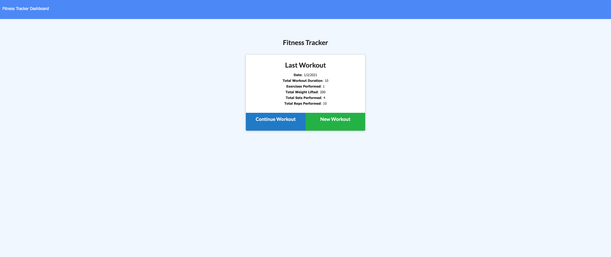
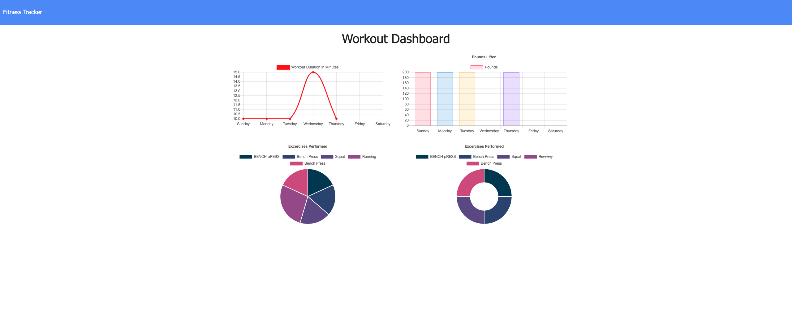
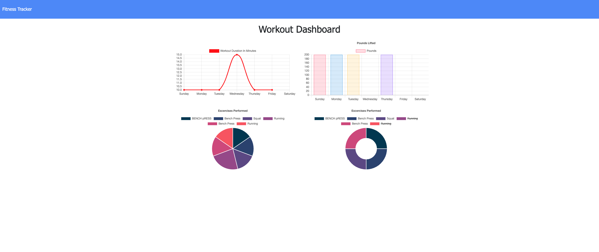

  <h1 align="center">Fitness Tracker</h1>

## Description
  A fitness app that allows the user to view, create, and track daily workouts. The user is able to log multiple exercises in a given day and also go back and update the workout. The user is able to track the name, type, weight, sets, reps and duration of each exercise. Cardiovascular exercises show the distance traveled in miles.

## Table Of Contents
- [Description](#discriptionOfProject)
- [Installation](#installationOfProject)
- [Usage](#usageOfProject)
- [License](#licenseOfProject)
- [Test](#testOfProject)
- [Issues](#issuesOfProject)
- [Contributors](#contributorsOfProject)

## Installation
  inquirer was installed for this package

## Usage
  To create and keep track of workouts that have been performed, tracked by minutes worked out by exercise and pounds lifted. Adding new workouts continues to build the data output. Then updates the tracked workout. [Fitness-Tracker](https://fitnessapp123.herokuapp.com/)

## License
  MIT

  This application is covered by the MIT license.

## Test
  na

## Issues
  Having issues with heroku having the same turn out as node server

## Contributors
  Myself, Michael Griffith

## Github
  GriffMike167

## Email
  griffithcmichael@gmail.com

